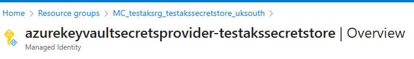
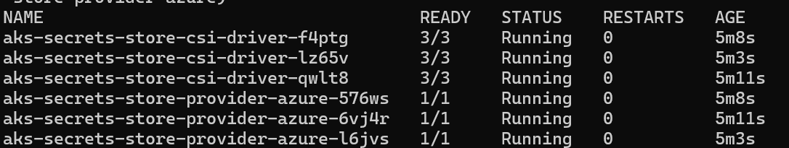
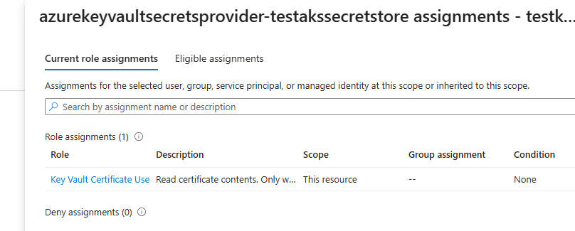
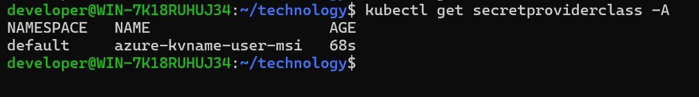
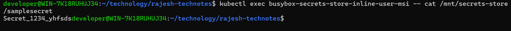

# AKS Integration with Azure Key Vault

In this article, I will be explaining different ways workloads in AKS can be integrated to use secrets from Azure Key Vault.

## Overview

There are multiple methods for workloads running in AKS to integrated with AKS. I will be focusing on below method in this article


## Method 1: Azure Key Vault Provider for Secrets Store CSI Driver

Workloads deployed on an Azure Kubernetes Services (AKS) cluster require Microsoft Entra application credentials or managed identities to access Microsoft Entra protected resources, such as Azure Key Vault and Microsoft Graph. Microsoft Entra Workload ID integrates with the capabilities native to Kubernetes to federate with external identity providers.

### Reference links

https://learn.microsoft.com/en-us/azure/aks/csi-secrets-store-driver


### Procedure

1. Create a resource group

   ```bash
   az group create --name testaksrg --location uksouth
   ```

2. Create an AKS cluster. Note that you will have to enable Azure Key Vault provider for Secrets Store CSI driver capability

   ```bash
   az aks create --name testakssecretstore --resource-group testaksrg --enable-addons azure-keyvault-secrets-provider --generate-ssh-keys
   ```

You may add the add-on for an existing cluster using the below command

```bash
az aks enable-addons --addons azure-keyvault-secrets-provider --name myAKSCluster --resource-group myResourceGroup
```

After you enable this feature, AKS creates a managed identity named azurekeyvaultsecretsprovider-xxx in the node resource group and assigns it to the Virtual Machine Scale Sets (VMSS) automatically. You can use this managed identity or your own managed identity to access the key vault. It's not supported to prevent creation of the identity. You can see the example identity created below.



You can verify the installation using the below command

```bash
az aks get-credentials --resource-group testaksrg --name testakssecretstore --overwrite-existing
kubectl get pods -n kube-system -l 'app in (secrets-store-csi-driver,secrets-store-provider-azure)'
```



3. Create an Azure Key Vault and set a secret

```bash
az keyvault create --name testkeyvaulttestaks --resource-group testaksrg --location uksouth --enable-rbac-authorization
az keyvault secret set --vault-name testkeyvaulttestaks --name samplesecret --value Secret_1234_yhfsds
```

4. The Secrets Store Container Storage Interface (CSI) Driver on Azure Kubernetes Service (AKS) provides various methods of identity-based access to your Azure Key Vault. In this article, I am using managed identity. You can see details on other options here(https://learn.microsoft.com/en-us/azure/aks/csi-secrets-store-identity-access?tabs=azure-portal&pivots=access-with-a-user-assigned-managed-identity)

I have provided the access using Azure Portal and assigned Key Vault certificate user role for the identity AKS created automatically earlier.




5. Create a SecretProviderClass using the following YAML. Make sure to use your own values for userAssignedIdentityID, keyvaultName, tenantId, and the objects to retrieve from your key vault.

```yml
# This is a SecretProviderClass example using user-assigned identity to access your key vault
apiVersion: secrets-store.csi.x-k8s.io/v1
kind: SecretProviderClass
metadata:
  name: azure-kvname-user-msi
spec:
  provider: azure
  parameters:
    usePodIdentity: "false"
    useVMManagedIdentity: "true"          # Set to true for using managed identity
    userAssignedIdentityID: <client-id>   # Set the clientID of the user-assigned managed identity to use
    keyvaultName: <key-vault-name>        # Set to the name of your key vault
    cloudName: ""                         # [OPTIONAL for Azure] if not provided, the Azure environment defaults to AzurePublicCloud
    objects:  |
      array:
        - |
          objectName: samplesecret
          objectType: secret              # object types: secret, key, or cert
          objectVersion: ""               # [OPTIONAL] object versions, default to latest if empty
    tenantId: <tenant-id>                 # The tenant ID of the key vault
```

```bash
kubectl apply -f secret.yaml
```



6. Create a pod using the below YAML


```yml
# This is a sample pod definition for using SecretProviderClass and the user-assigned identity to access your key vault
kind: Pod
apiVersion: v1
metadata:
  name: busybox-secrets-store-inline-user-msi
spec:
  containers:
    - name: busybox
      image: registry.k8s.io/e2e-test-images/busybox:1.29-4
      command:
        - "/bin/sleep"
        - "10000"
      volumeMounts:
      - name: secrets-store01-inline
        mountPath: "/mnt/secrets-store"
        readOnly: true
  volumes:
    - name: secrets-store01-inline
      csi:
        driver: secrets-store.csi.k8s.io
        readOnly: true
        volumeAttributes:
          secretProviderClass: "azure-kvname-user-msi"
```

7. Show secrets held in the secret store using the below command


```bash
kubectl exec busybox-secrets-store-inline-user-msi -- ls /mnt/secrets-store/
```

Display a secret using the below command

```bash
kubectl exec busybox-secrets-store-inline-user-msi -- cat /mnt/secrets-store/samplesecret
```

