# Deploying a language model using Azure Foundry

In this article, I will be explaining procedure to create an AI agent using Azure AI foundry and VScode Foundry extension.

## Procedure

1. Install VScode Foundry extension from the marketplace.

Open Visual Studio Code.

Select Extensions from the left pane (or press Ctrl+Shift+X).

In the search bar, type Microsoft Foundry and press Enter.

Select the Microsoft Foundry extension from Microsoft and click Install.

After installation is complete, verify the extension appears in the primary navigation bar on the left side of Visual Studio Code.

2. Sign in to your Azure account through VScode and then create a new Foundry project.

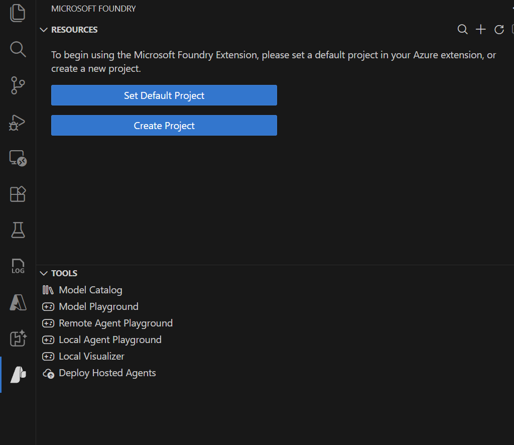

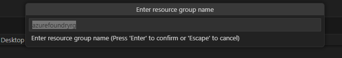

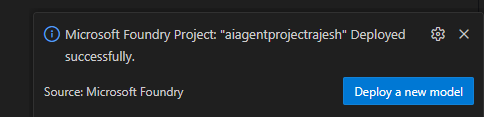

3. You can see that below resources are created in your Azure portal once the project is created.

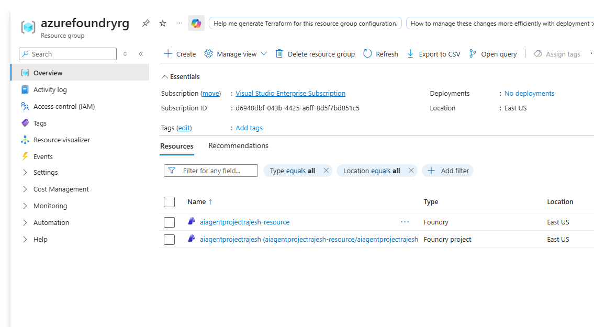

4. You can deploy a model of your choice to this project. Here, I have selected gpt-4o-mini model.

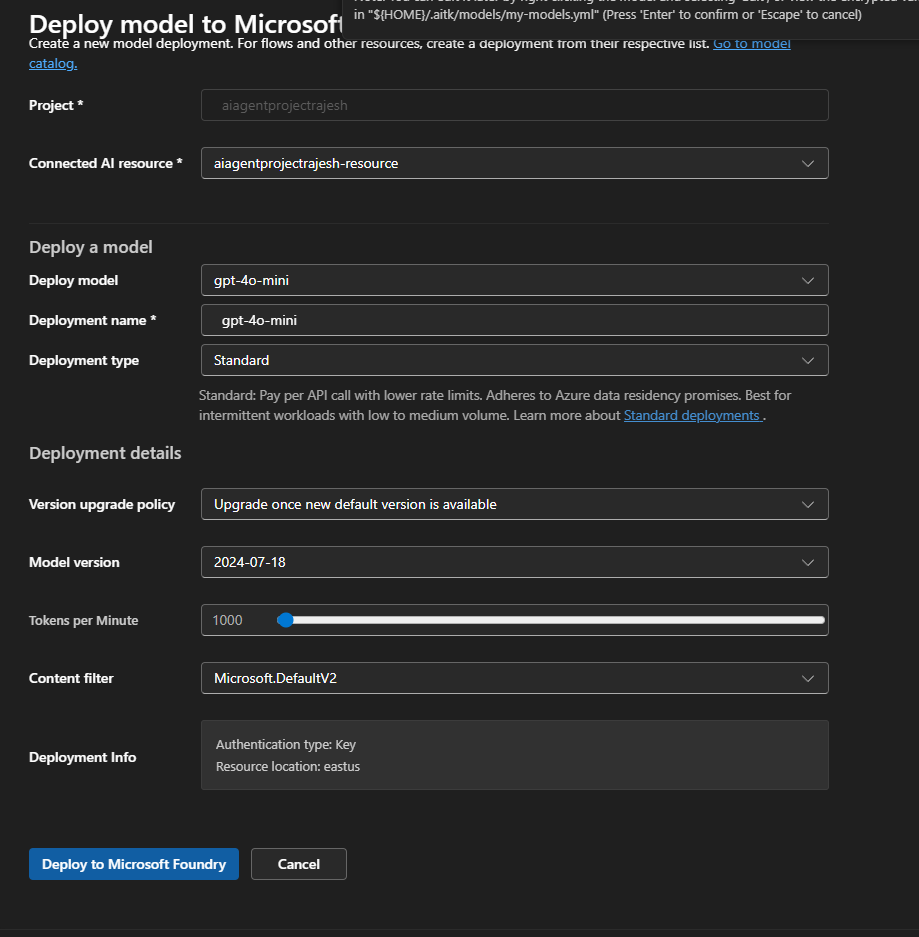
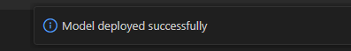

5. Now you can create an AI agent using designer view.

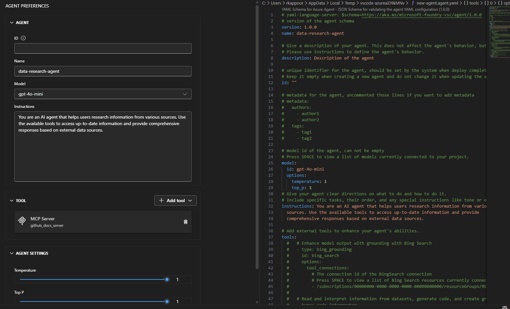

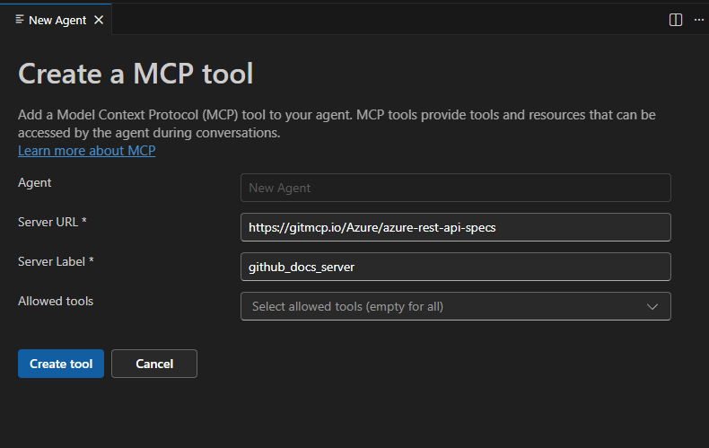

6. You can test your agent in the playground.

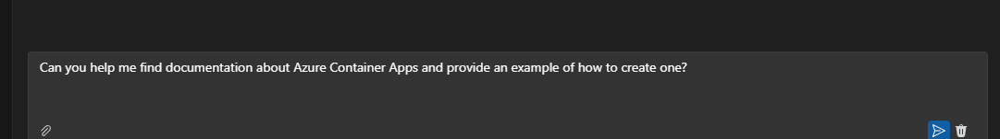

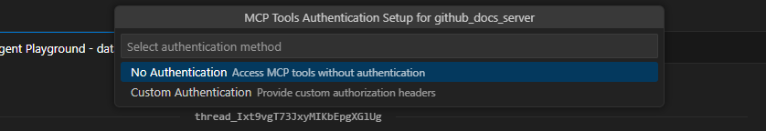

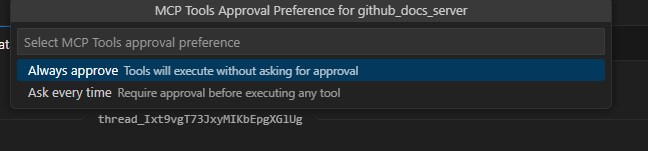

You can select "No Authentication" for MCP server and MCP approval preference as "Always approve" for testing purpose.

7. You can see this agent from Microsoft Foundry portal as well.

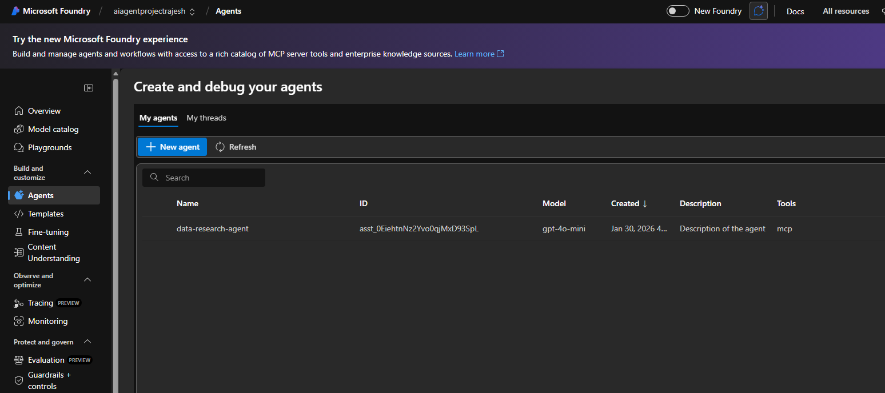

8. You can generate sample code to use this agent in your application. You can use this code as a starting point for building applications that leverage your AI agent.

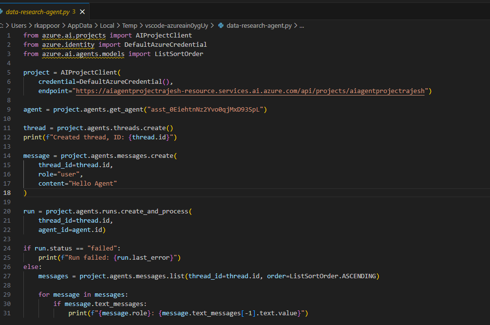

9. After testing this, please make sure to delete the resources created to avoid unnecessary costs. You have to delete the agents, models and the foundry project, resource group in order to delete all the resources created.