# Deploying a RAG Application using Foundry

In this article, I will be explaining procedure to create a RAG (Retrieval-Augmented Generation) application using Azure AI Foundry. RAG combines the power of pre-trained language models with external knowledge sources to generate more accurate and contextually relevant responses. This approach is particularly useful for applications such as chatbots, virtual assistants, and question-answering systems.

## Procedure

1. **Set Up Azure AI Foundry**: 

In a web browser, open the Foundry portal at https://ai.azure.com/managementCenter/allResources and sign in using your Azure credentials. 

Create a new AI Hub resource

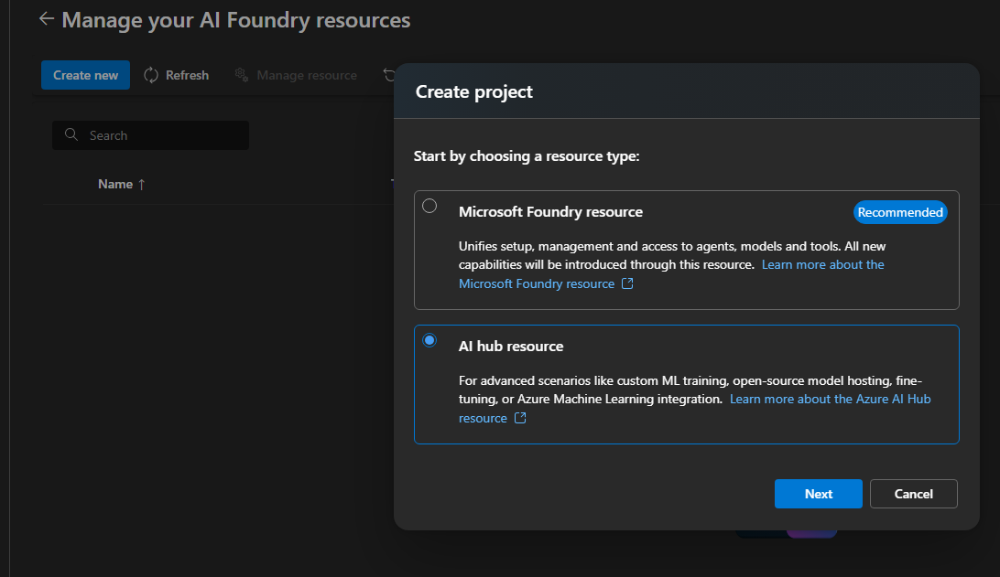

2. Deploy an embedding model. We are going to use text-embedding-ada-002 model for generating embeddings for documents and queries.

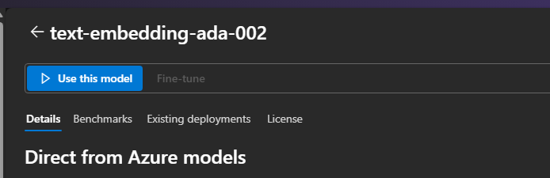

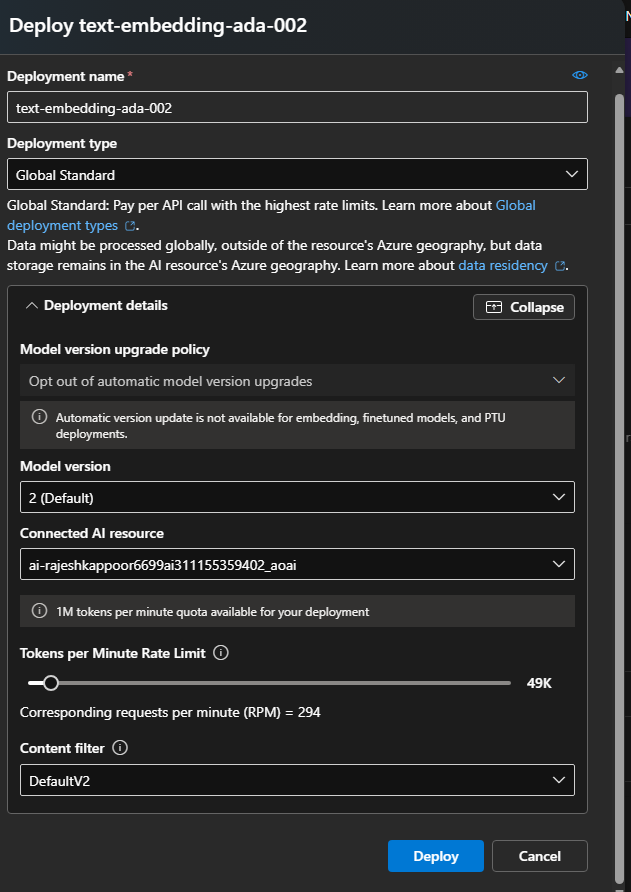

3. Deploy a language model

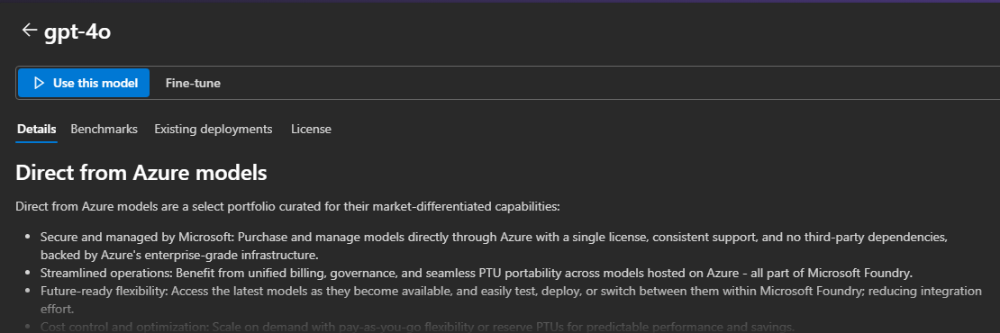

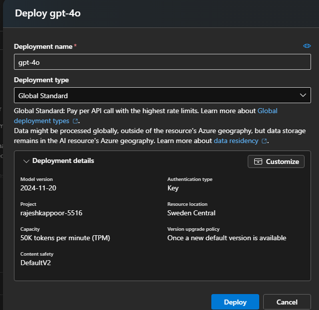

4. Add data to your project

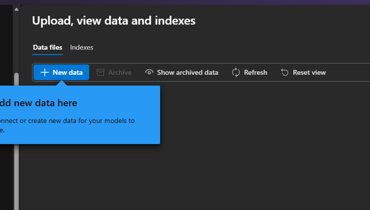

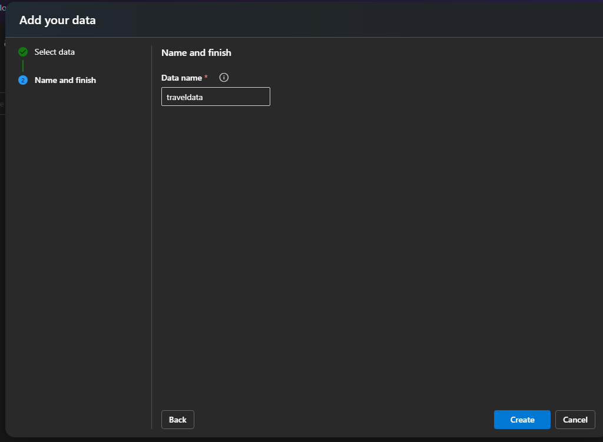

5. Create an Index for your data. Here, you will have to create an AI search service.

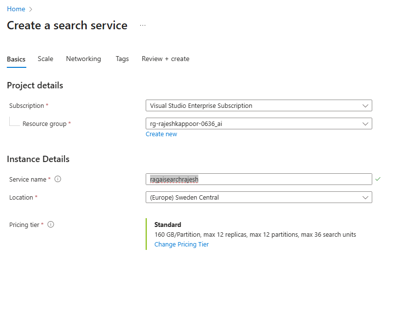

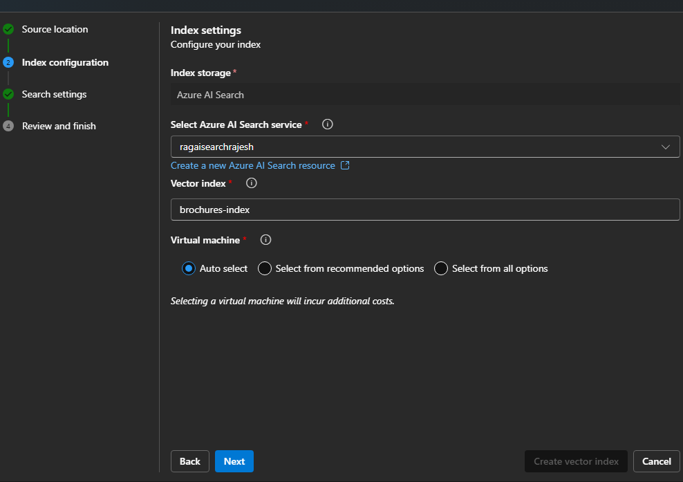

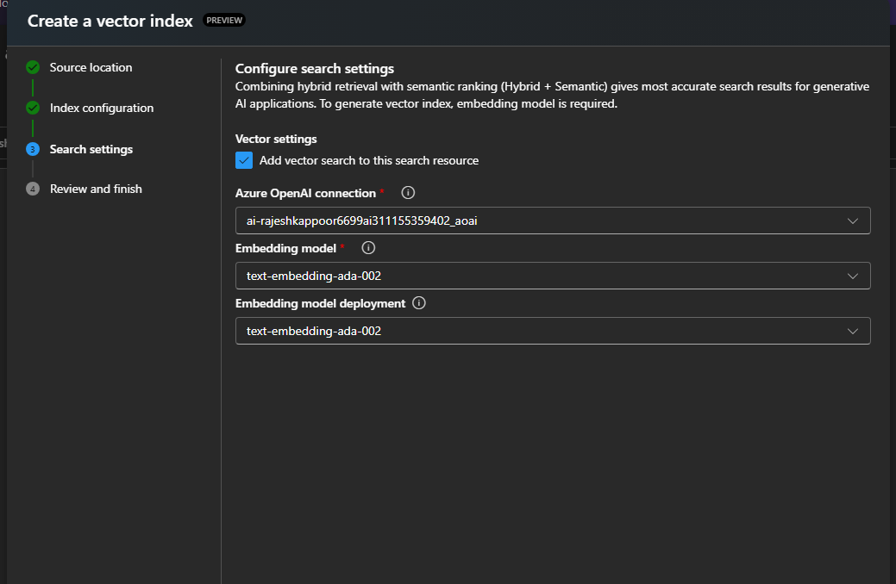

Wait for the index to be created.The index creation operation consists of the following jobs:

Crack, chunk, and embed the text tokens in your brochures data.
Create the Azure AI Search index.
Register the index asset.

You can check the status of the index creation job in the Jobs tab.

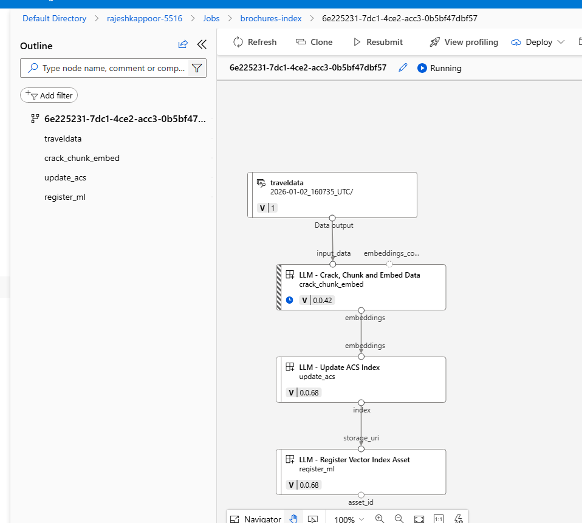

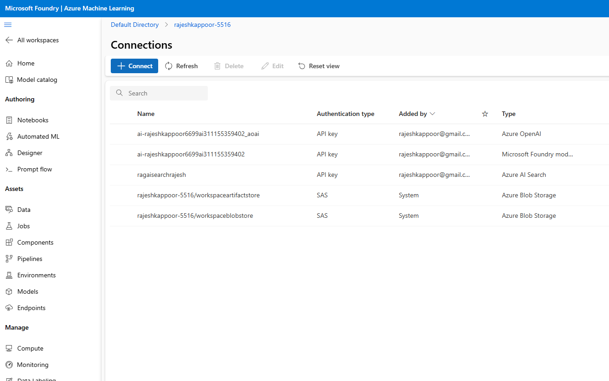

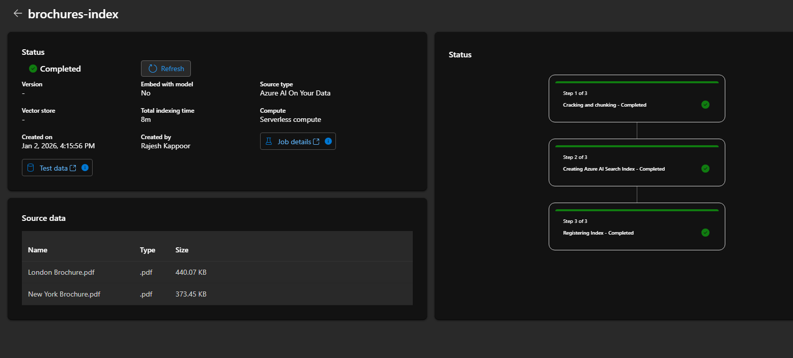

6. Test the index in the playground. Here you can select the index created and search type

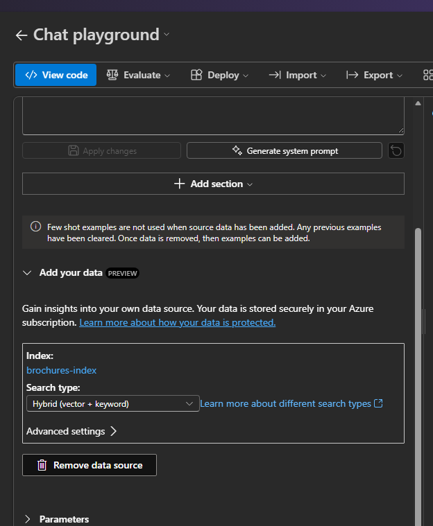

You can see that answer is based on our data.

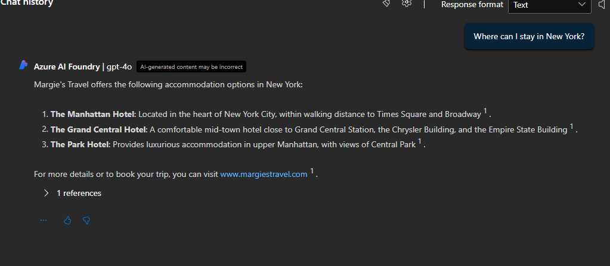

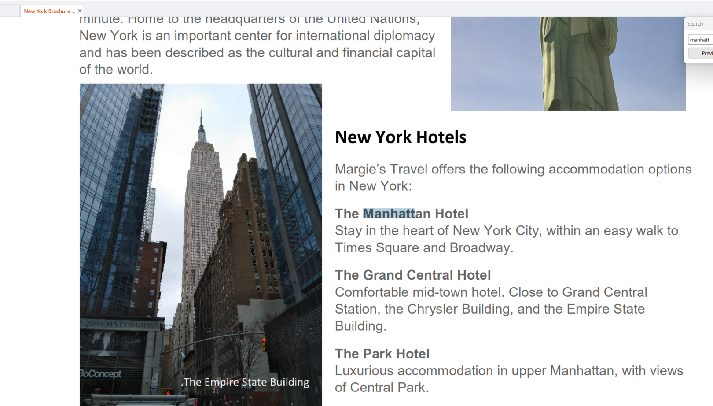

7. I have provided code to create the RAG application using Azure AI Search indedx.

