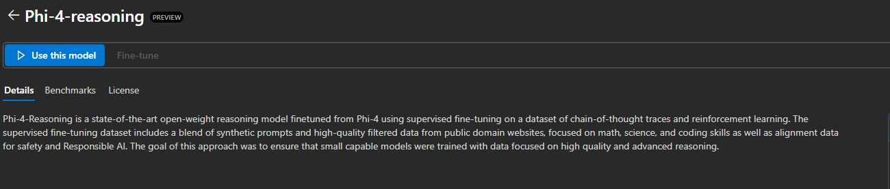
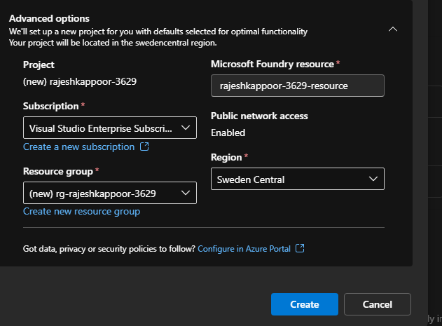
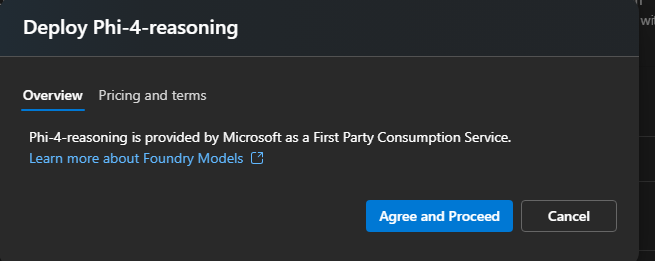
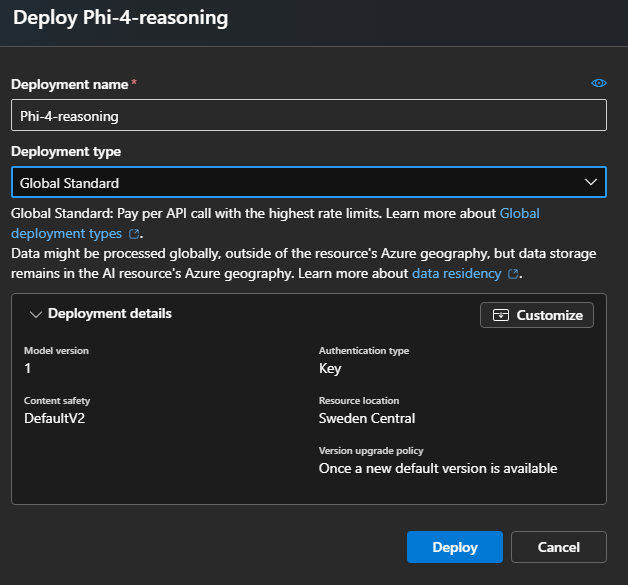
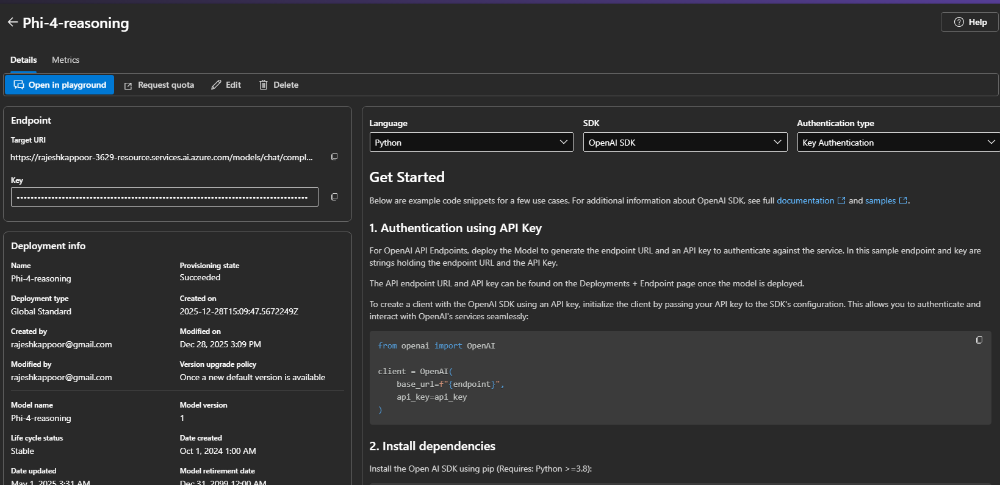
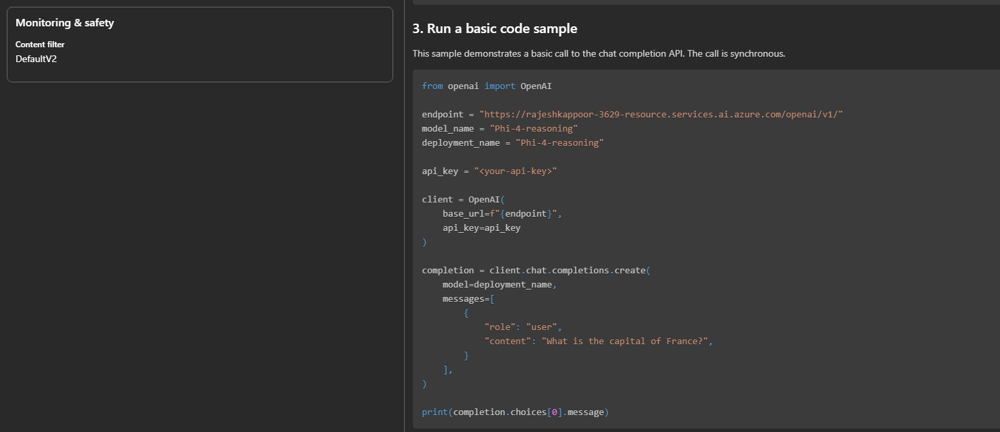
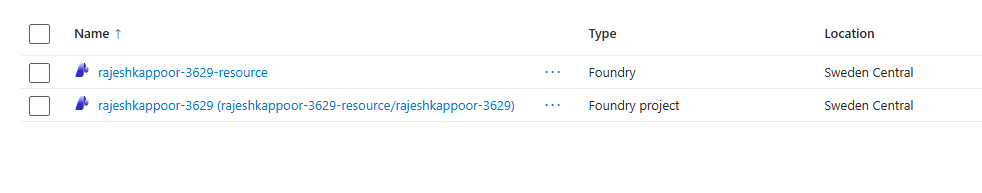
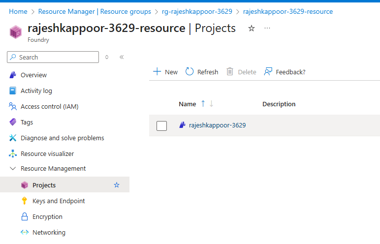
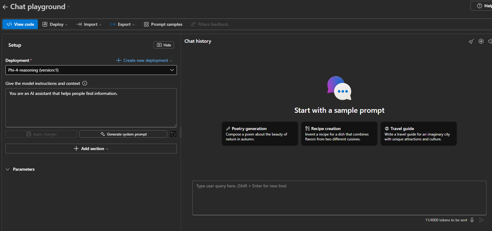
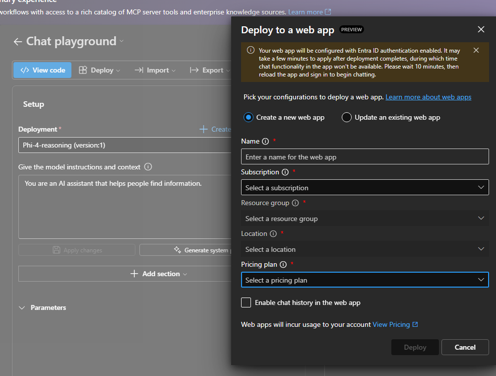

# Deploying a language model using Azure Foundry

In this article, I will be explaining procedure to use Azure AI foundry to deploy a language model for various NLP tasks.

## Procedure

1. Login to https://ai.azure.com/ 

2. In the search results, select the Phil-4-reasoning model.

3. Click on "Use this model" and create a project to work with this model. You can select Resource group, subscription, and region as per your preference.

4. Once the project is created, you will be redirected to the project page. Here, you can see various options to work with the model.

5. Note that, this will create 2 Azure resources in your resource group - Azure Foundry and azure Foundry project.

6. You can play around with the model using the playground option. If you are satisfied with the results, you can deploy the model using the deploy option to a Azure Web App.

7. I have given sample code to use this model using python SDK.
