# VNET connection using Virtual Network Gateways

In this article, I will be explaining procedure to use a Virtual network gateway to connect between 2 VNETs in Azure

## Overview

VNET Peering is the best possible method to connect 2 VNETs in Azure. But there is another method you can use to connect VNETS and that is using VNET Gateways.

✅ When to Use VNet Gateway Instead of VNet Peering
1. When the VNets are in different Azure regions and you need encryption

Global VNet Peering is NOT encrypted.

If you require encrypted traffic across regions, you need:

VNet-to-VNet VPN (IPsec encryption) using VPN Gateways.

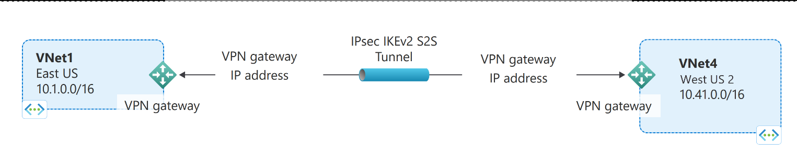

## Steps

1. Creating Source VNET named source_vnet

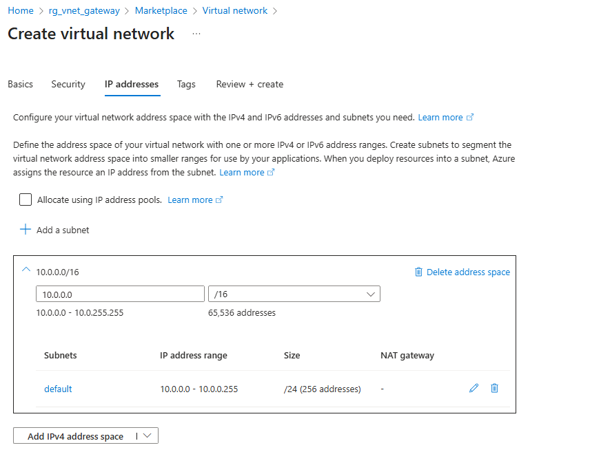

2. Creating a Destination VNET named destination_vnet

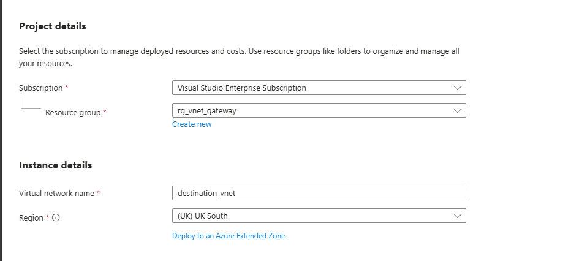

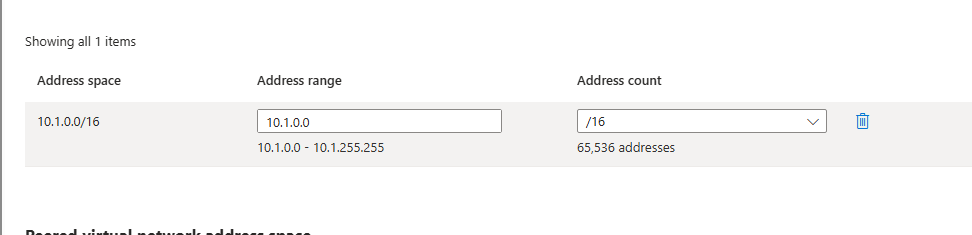

3. Create a VM in Source VNET

4. Create a VM in Destination VM

5. Test connectivity from Source VM to Destination VM. You will see that SSH connection is timing out

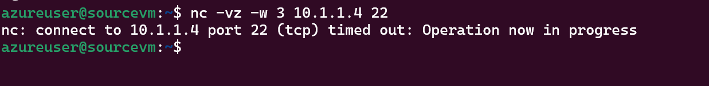

6. Create a VNET Gateway in Source VNET. Note that you have to create a subnet called "GateWaySubnet" in the Source VNET first

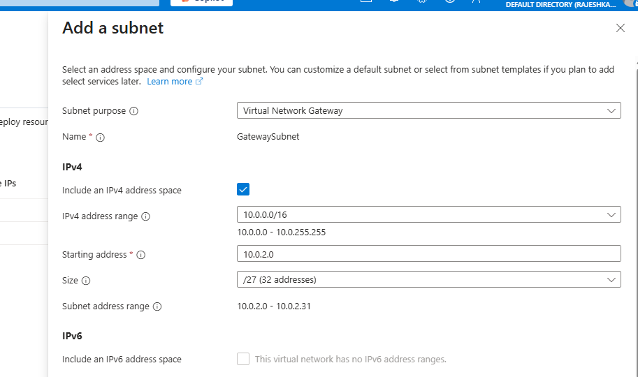

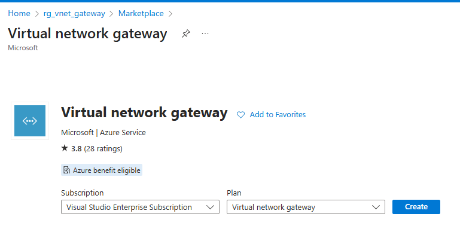

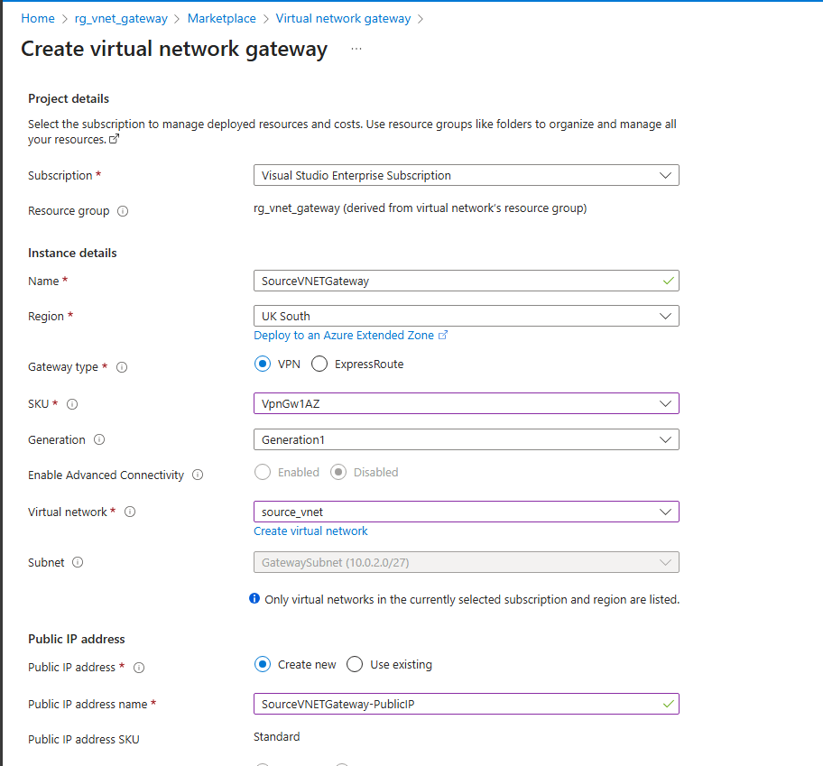

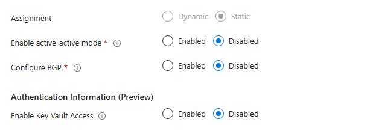

7. Create a VNET Gateway in Destinaton VNET. Note that you have to create a subnet called "GateWaySubnet" in the Destination VNET first.

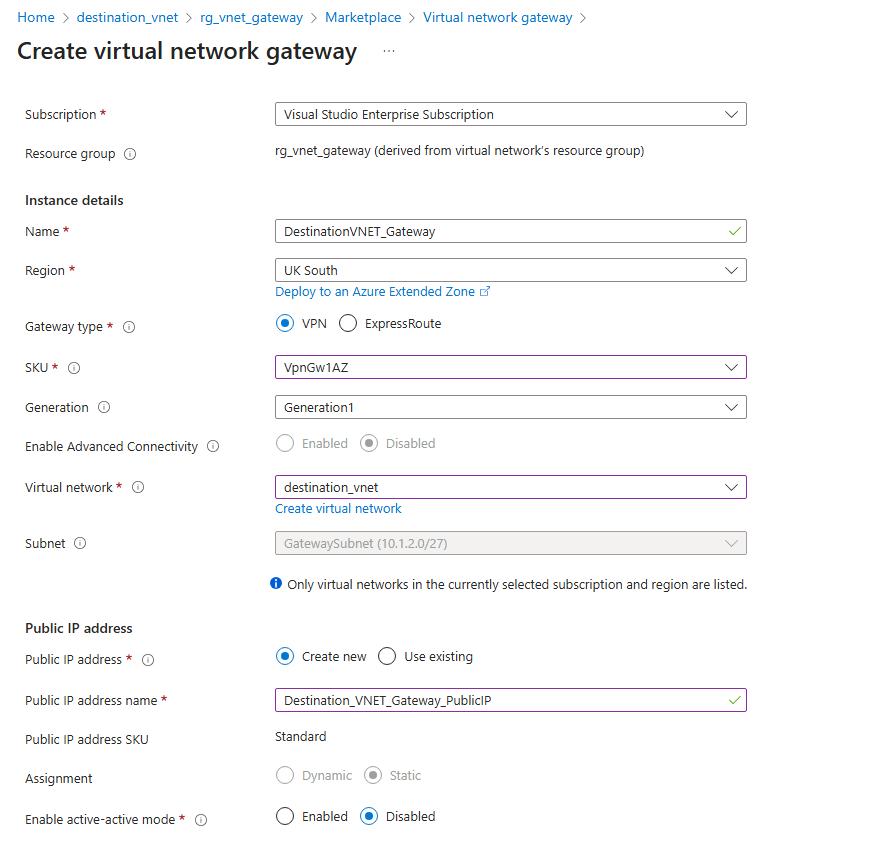

8. Create the connection from Source VNET to Destination VNET using Source VNET Gateway

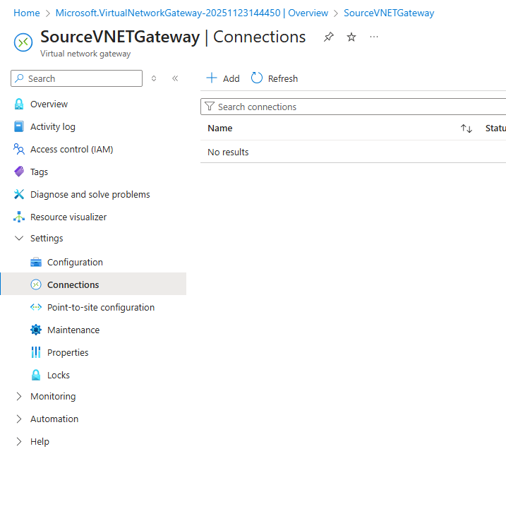

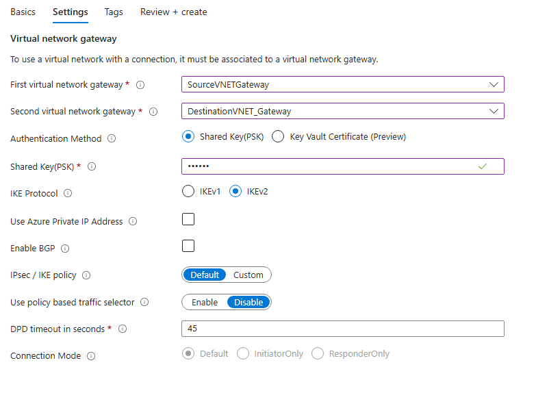

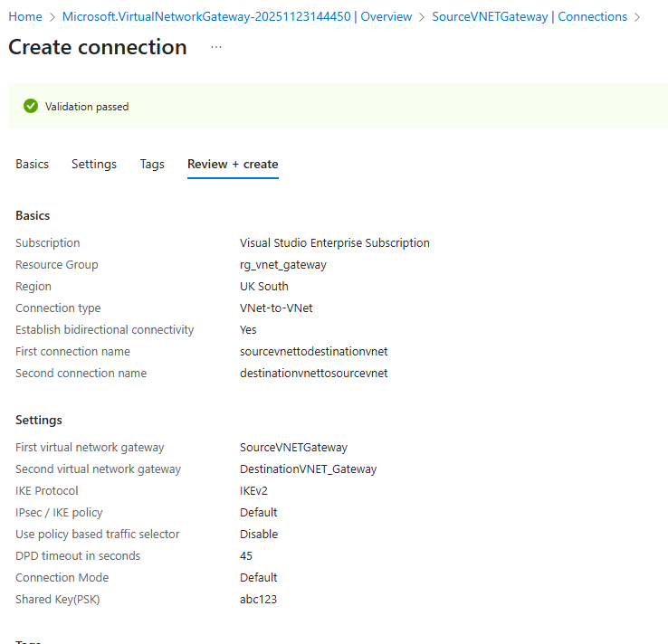

During the connection set up, you will see the connection status as "Updating". You can check the connections using the keyword search "vpn" and seelct "Connections"

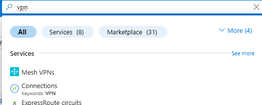

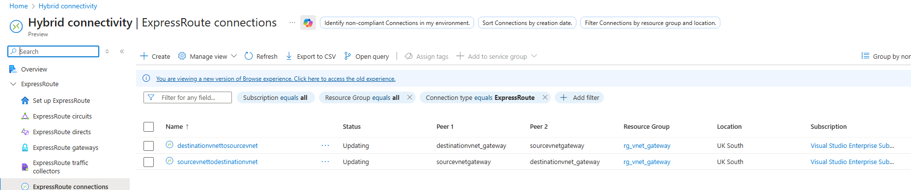

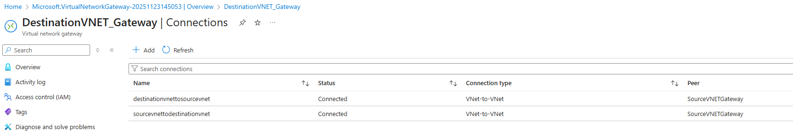

9. Check the connection between Source VM and Destination VM now and you can see that connection is successful now !!!

10. Note that, there will be a routed added in "effective route" like below, if you check the Source VM NIC

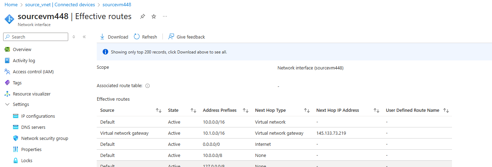

