# Configure ExpressRoute Gateway and provision an ExpressRoute Circuit

In this article, I will be explaining procedure to create an ExpressRoute Circuit and configure an ExpressRoute Gateway in Azure.

## Overview

To connect your Azure virtual network and your on-premises network via ExpressRoute, you must create a virtual network gateway first. A virtual network gateway serves two purposes: to exchange IP routes between the networks and to route network traffic.

When you create a virtual network gateway, you need to specify several settings. One of the required settings, ‘-GatewayType’, specifies whether the gateway is used for ExpressRoute, or VPN traffic. The two gateway types are:

VPN - To send encrypted traffic across the public Internet, you use the gateway type ‘VPN’. This is also referred to as a VPN gateway. Site-to-Site, Point-to-Site, and VNet-to-VNet connections all use a VPN gateway.
ExpressRoute - To send network traffic on a private connection, you use the gateway type ‘ExpressRoute’. This is also referred to as an ExpressRoute gateway and is the type of gateway used when configuring ExpressRoute.
Each virtual network can have only one virtual network gateway per gateway type. For example, you can have one virtual network gateway that uses -GatewayType VPN, and one that uses -GatewayType ExpressRoute.

## References

https://learn.microsoft.com/en-us/azure/expressroute/expressroute-introduction

https://learn.microsoft.com/en-us/azure/expressroute/expressroute-circuit-peerings

https://learn.microsoft.com/en-us/azure/expressroute/about-fastpath

https://learn.microsoft.com/en-us/azure/expressroute/expressroute-locations-providers?tabs=america%2Ca-c%2Ca-k 

## Steps

1. Create a Virual Network

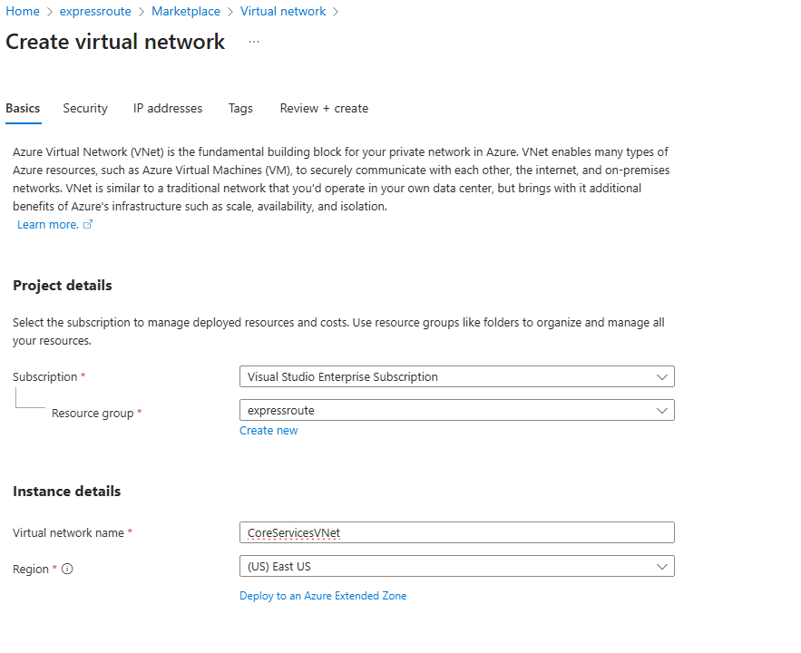

2. Create a Subnet named GatewaySubnet in the Virtual Network

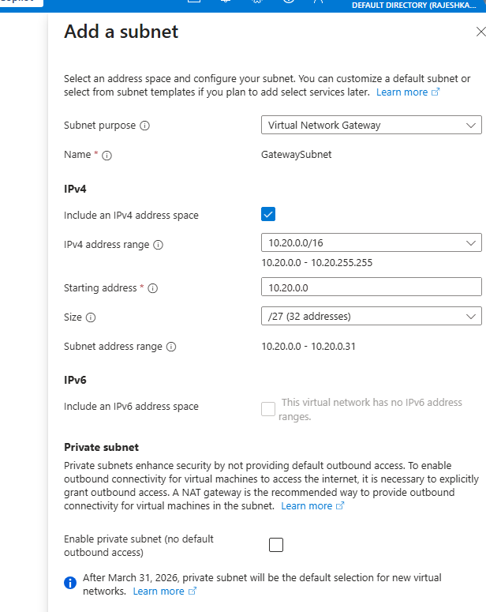

3. Create the Virual Network Gateway with GatewayType as ExpressRoute

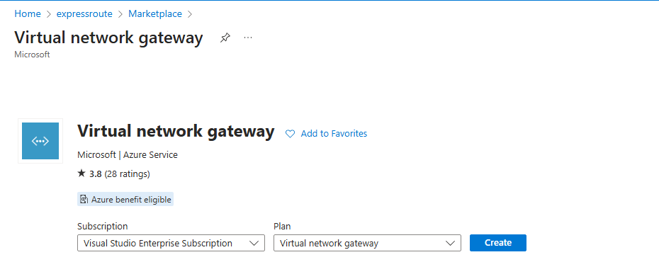

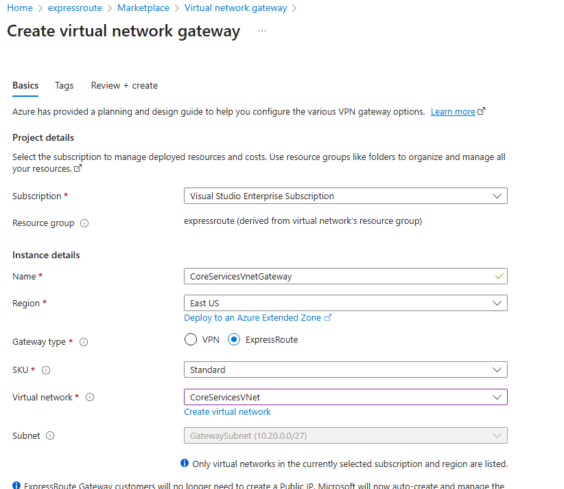

4 . Create the ExpressRoute Circuit

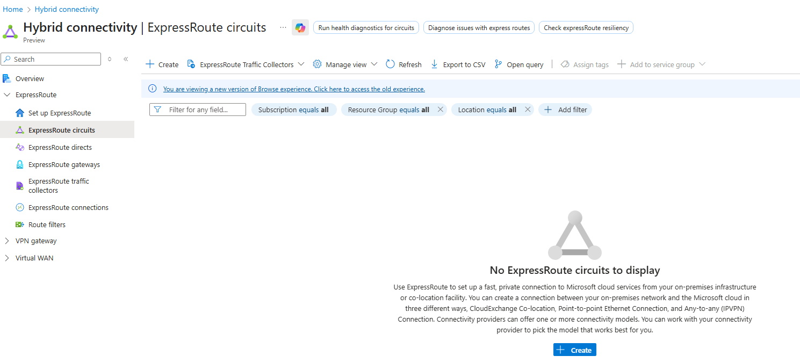

Note that there are 3 resiliency options available when creating an ExpressRoute circuit:

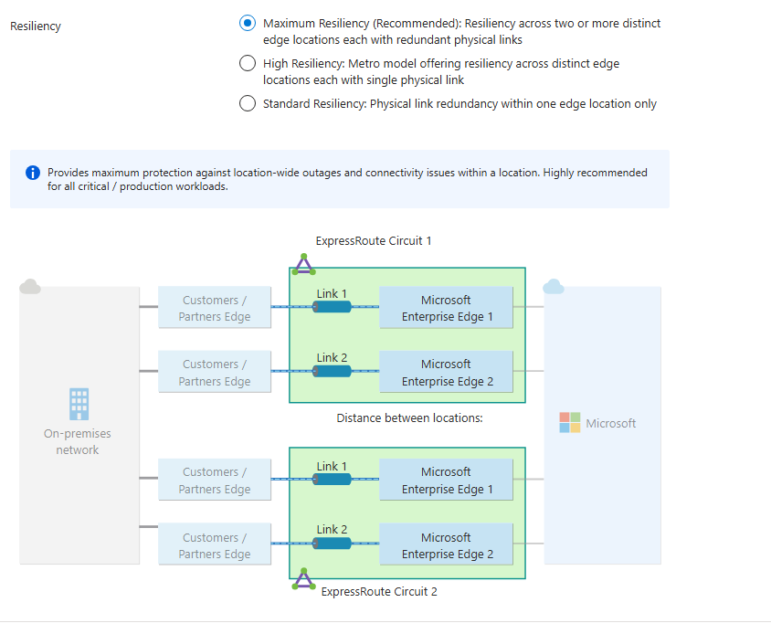

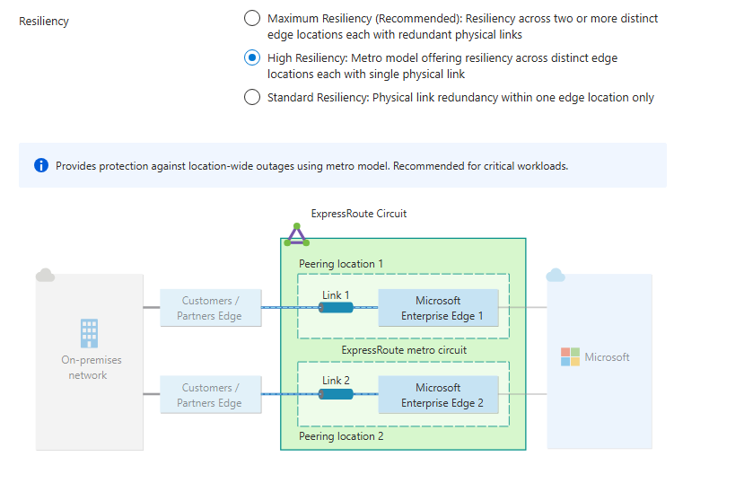

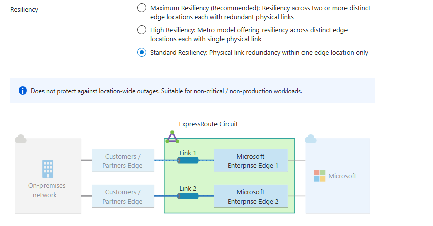

You can select the SKU, Port type(Provider or ExpressRoute Direct), Billing model and the Bandwidth as per your requirement.

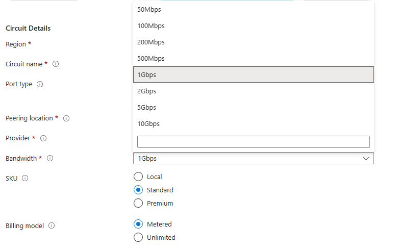

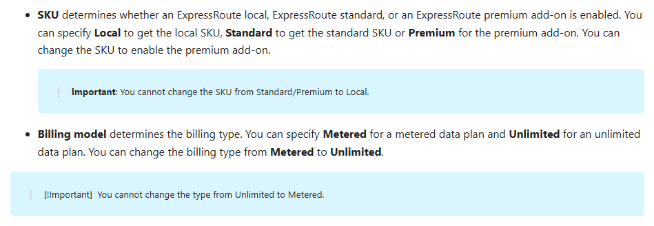

5. Retrieve the Service Key of the ExpressRoute Circuit

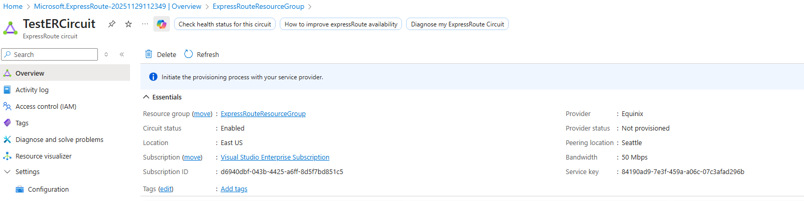

On this page, Provider status gives you the current state of provisioning on the service-provider side. Circuit status provides you the state on the Microsoft side.

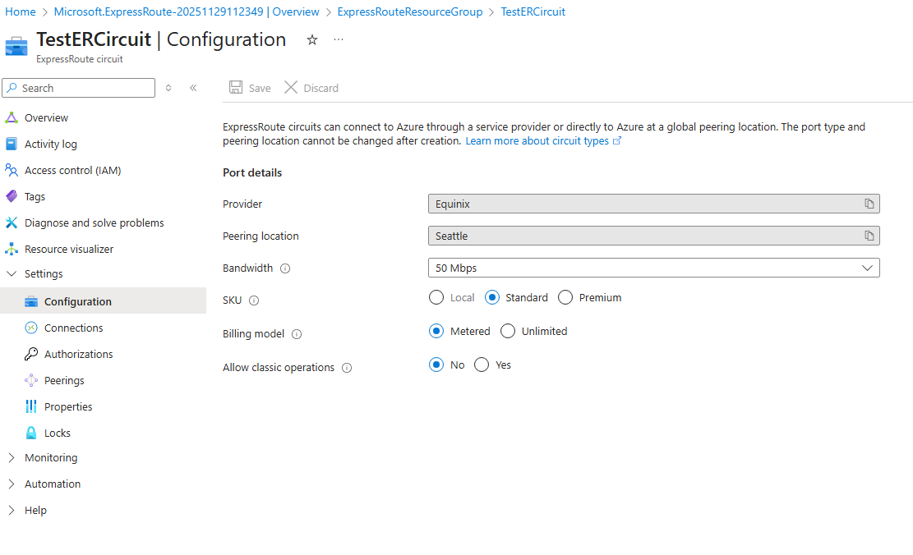

