# Configuring Front Door for highly available web applications

In this article, I will be explaining procedure to use Azure Front Door to route traffic to backend pools in different regions for high availability and improved performance.

## Overview

In this lab, we will set up an Azure Front Door configuration that pools two instances of a web application that runs in different Azure regions. This configuration directs traffic to the nearest site that runs the application. Azure Front Door continuously monitors the web application.

## References

https://learn.microsoft.com/en-us/azure/frontdoor/front-door-overview
https://microsoftlearning.github.io/AZ-700-Designing-and-Implementing-Microsoft-Azure-Networking-Solutions/Instructions/Exercises/M05-Unit%206%20Create%20a%20front%20door%20for%20a%20highly%20available%20web%20application%20using%20the%20Azure%20portal.html 

## Architecture Diagram

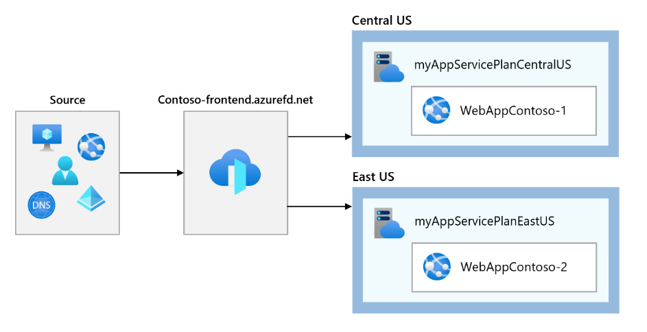

## Steps

1. Create Webapp in Central US region

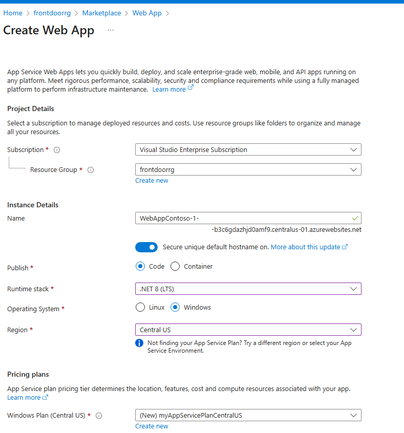

2. Make sure that it's running fine by accessing the URL

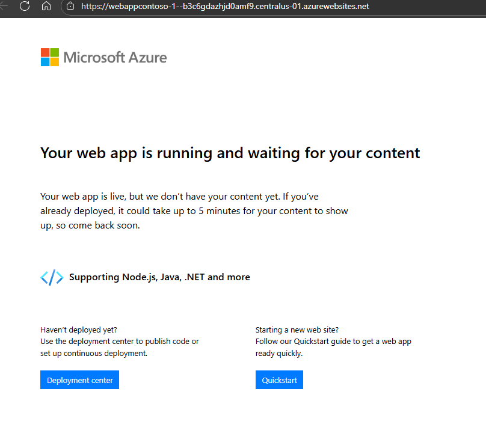

3. Create Webapp in East US region. Check that it's running fine by accessing the URL.

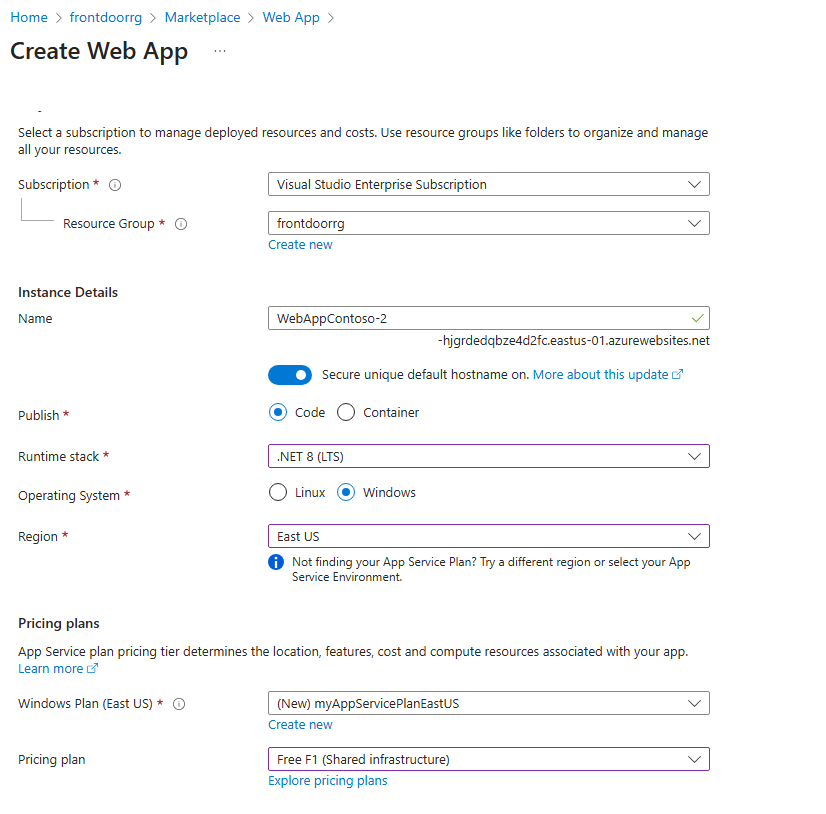

4. Create Front Door for your applications

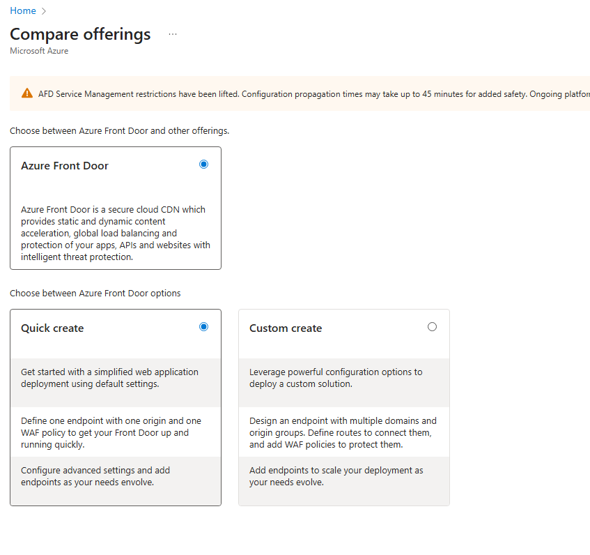

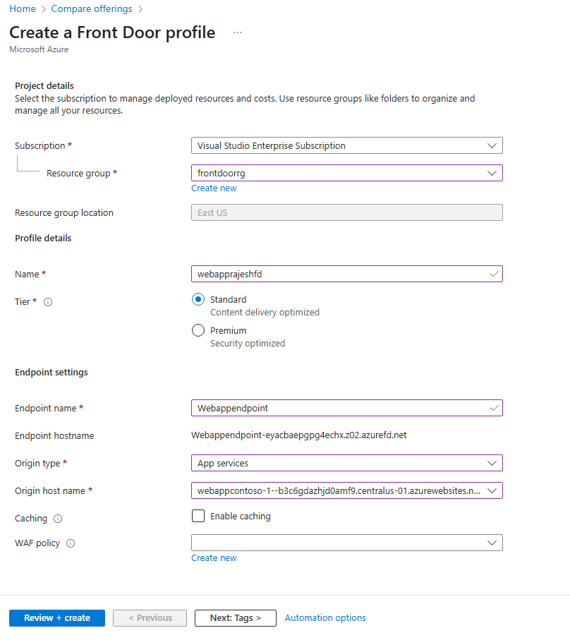

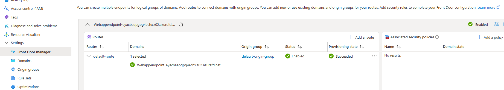

5. You can update the origin group settings to configure second webapp as secondary

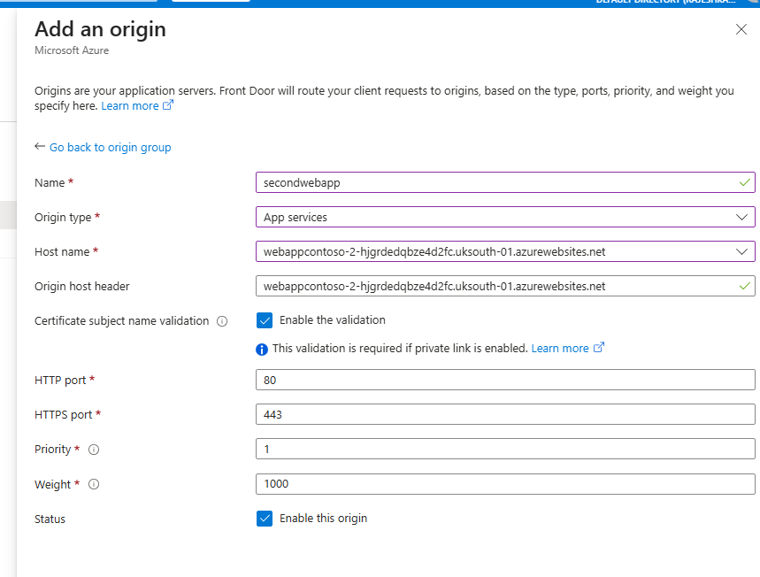

6. Access the Front Door URL to verify that it's working fine

7. You can test the failover by stopping one of the webapps and accessing the Front Door URL again. It should route the traffic to the other webapp.

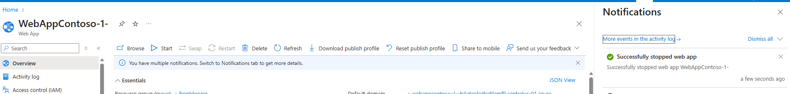

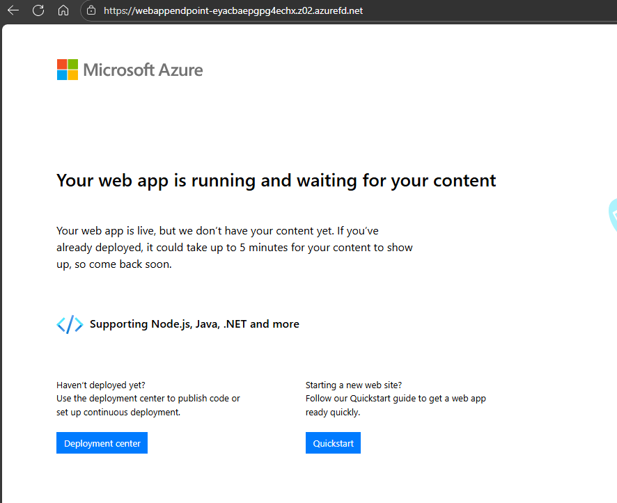

8. Try stopping the other webapp and accessing the Front Door URL again to see that it's not accessible now.

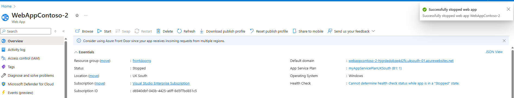

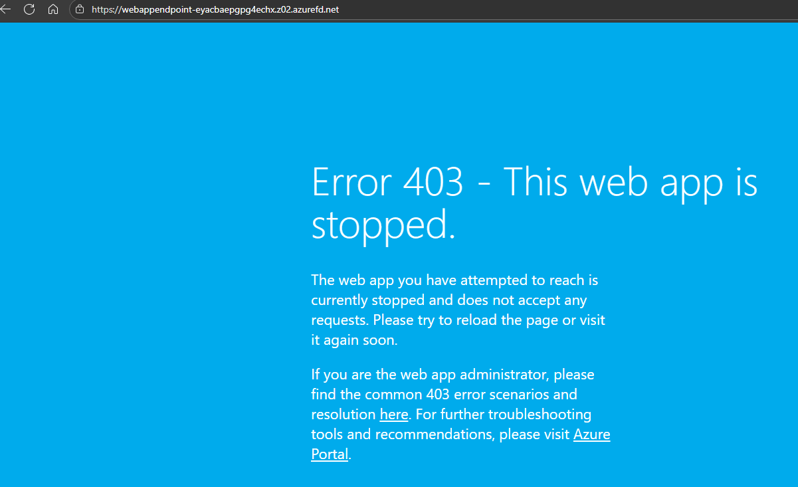

