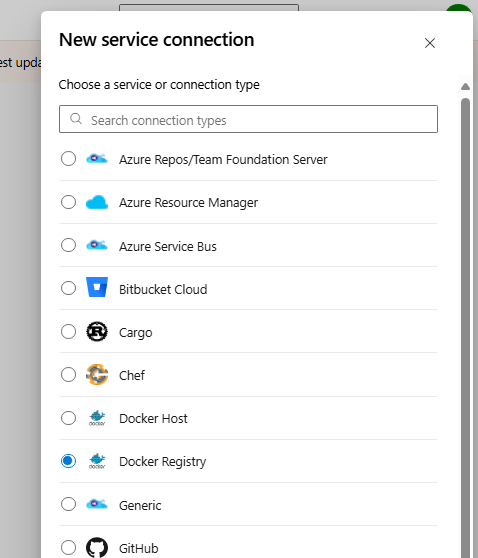
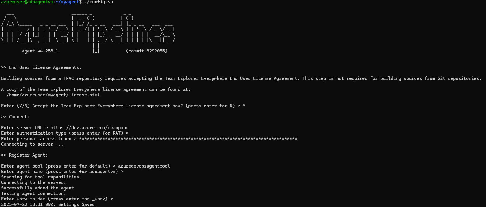
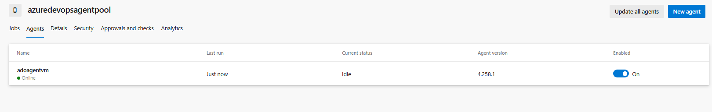
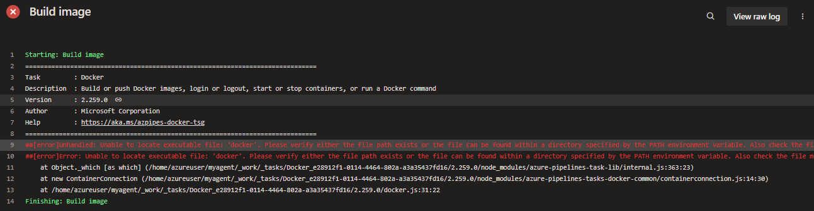
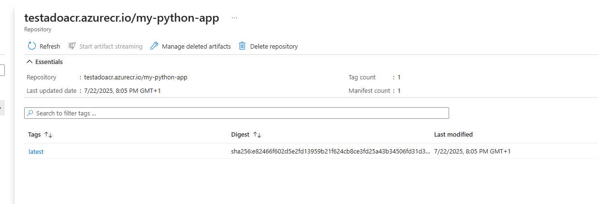

In this article, I will explain the steps I have performed for containerising a Web application, push the image to Azure Container registry
and deploy to AKS automatically using Azure DevOps

1. Create the Container registry from Azure Portal
2. Create the new project in your Azure DevOps Organisation
3. Clone the ADO Project and you can add the files from my repo for experimenting with this
4. Create the Service connection to Azure Container registry in Azure DevOps. 

Go to Project Settings → Service connections

Create a new Docker Registry connection

Choose Azure Container Registry and select your subscription and ACR

Name it something like acr-connection

4. Steps for adding a self hosted pool is given in the below documentation

https://learn.microsoft.com/en-us/azure/devops/pipelines/agents/personal-access-token-agent-registration?view=azure-devops

https://learn.microsoft.com/en-us/azure/devops/pipelines/agents/linux-agent?view=azure-devops&tabs=IP-V4#check-prerequisites

5.  Note that, if docker is not installed in self hosted VM, you can get errors like this

6. After running the pipeline, you can see that ADO has successfully built the image and pushed to ACR.

7. 
