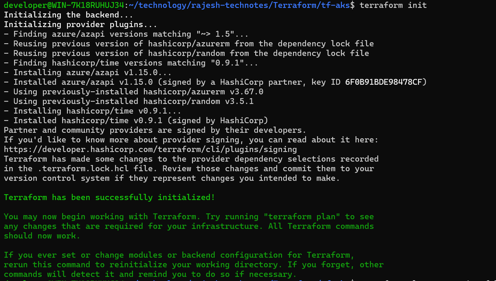
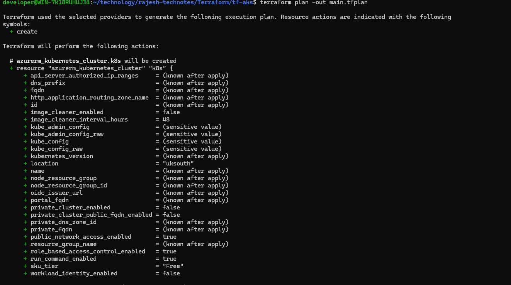
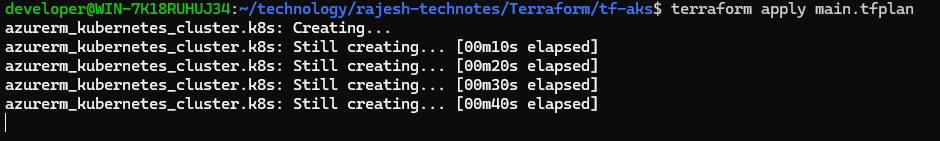
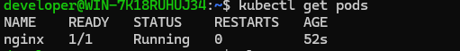
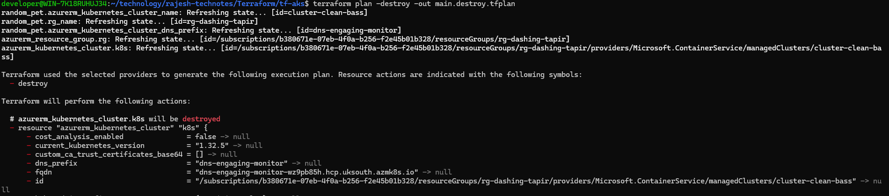
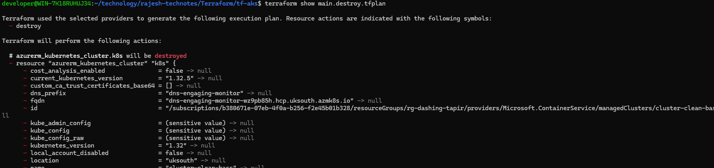

This technical note showing the steps I have followed for installation of Azure Kubernetes Servic(AKS) cluster using Terraform.

### References

https://learn.microsoft.com/en-us/azure/aks/learn/quick-kubernetes-deploy-terraform?pivots=development-environment-azure-cli

### Procedure
1. Install Terraform: You can easily follows the steps mentioned here(https://developer.hashicorp.com/terraform/install)for the installation


```bash
wget -O - https://apt.releases.hashicorp.com/gpg | sudo gpg --dearmor -o /usr/share/keyrings/hashicorp-archive-keyring.gpg
echo "deb [arch=$(dpkg --print-architecture) signed-by=/usr/share/keyrings/hashicorp-archive-keyring.gpg] https://apt.releases.hashicorp.com $(grep -oP '(?<=UBUNTU_CODENAME=).*' /etc/os-release || lsb_release -cs) main" | sudo tee /etc/apt/sources.list.d/hashicorp.list
sudo apt update && sudo apt install terraform
```

2. I have provided the sample Terraform files I have used for this project. Go to the directory tf-aks and execute terraform init. Please note that you will have to change the subscription id in providers.tf file. 



terraform init -upgrade

3. Run terraform plan command to create an execution plan. The terraform plan command creates an execution plan, but doesn't execute it. Instead, it determines what actions are necessary to create the configuration specified in your configuration files. This pattern allows you to verify whether the execution plan matches your expectations before making any changes to actual resources.

terraform plan -out main.tfplan

This will output the resources Terraform is going to create 



4. Run terraform apply to apply the execution plan to your cloud infrastructure.

terraform apply main.tfplan



5. Verify that cluster created successfully and you can connect and operate the AKS cluster

```bash
az aks get-credentials --resource-group rg-dashing-tapir --name cluster-clean-bass --overwrite-existing
kubectl run nginx --image=nginx
kubectl get pods
```



6. You can destroy whole infra created using Terraform using 

terraform plan -destroy -out main.destroy.tfplan



terraform show main.destroy.tfplan // This command is useful to check which resources will be destroyed



terraform apply main.destroy.tfplan

