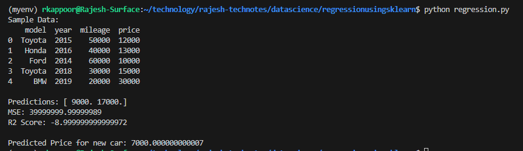

This technical note showing the steps I have followed for installation of Azure Kubernetes Servic(AKS) cluster using Terraform.

### Installation steps

1. Create the python virtual environment

python3 -m venv myenv
source myenv/bin/activate

2. Install the required packages

pip install -r requirements.txt

3. Run the python script

python regression.py

